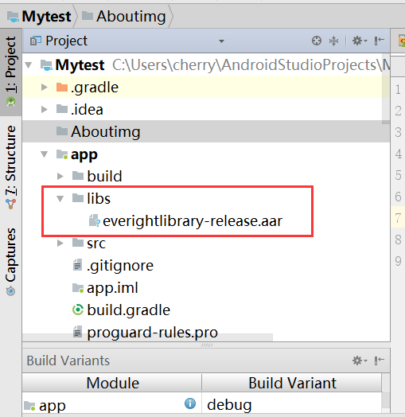
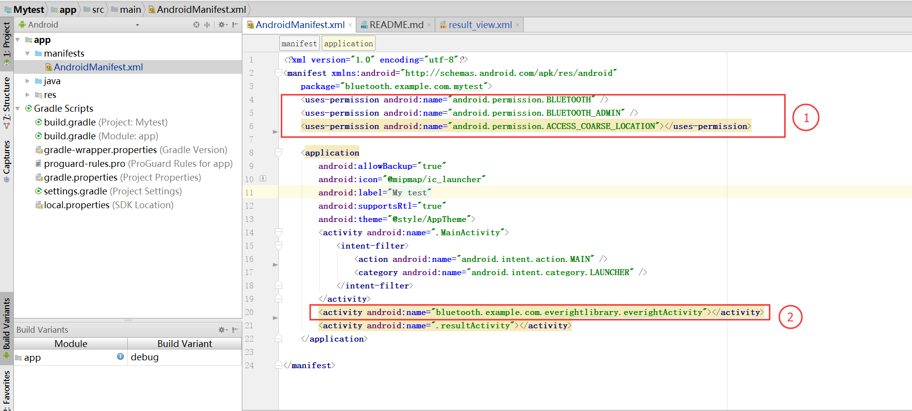
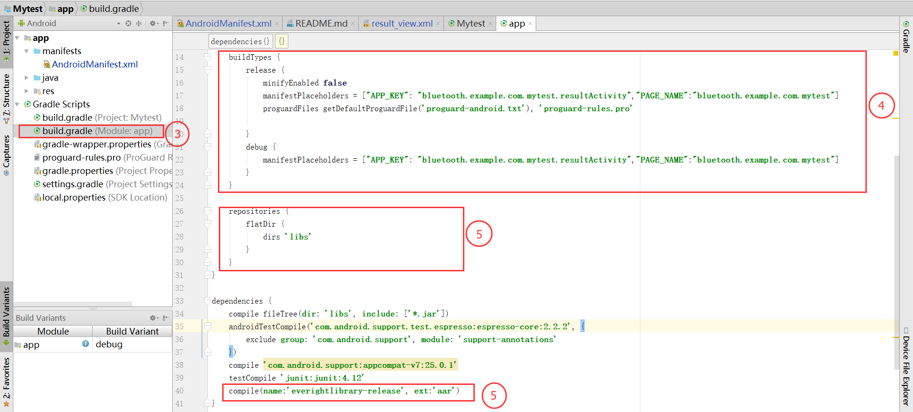
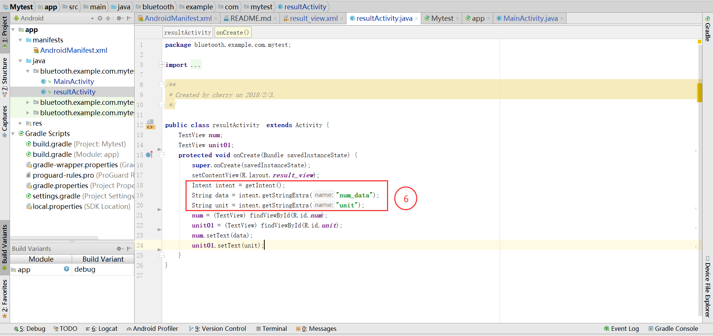
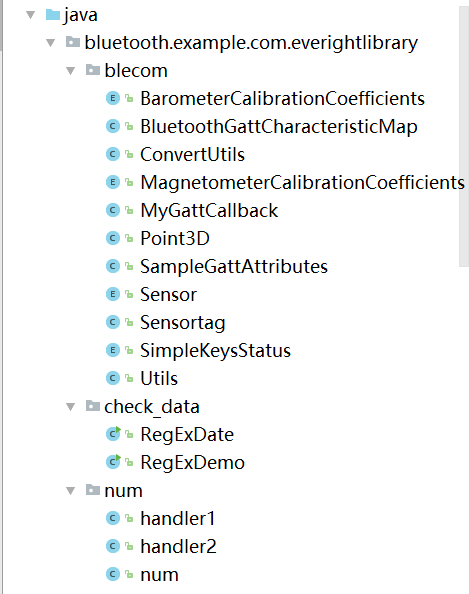
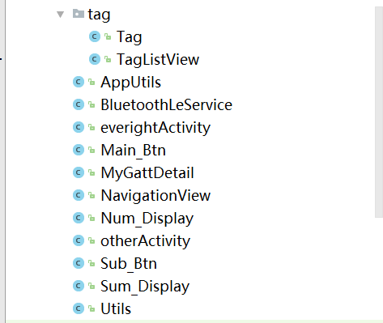
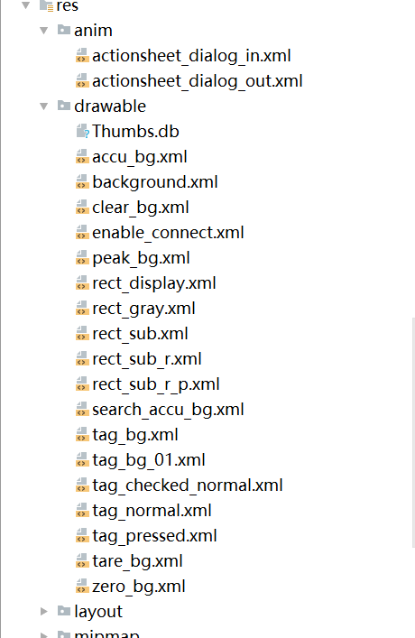
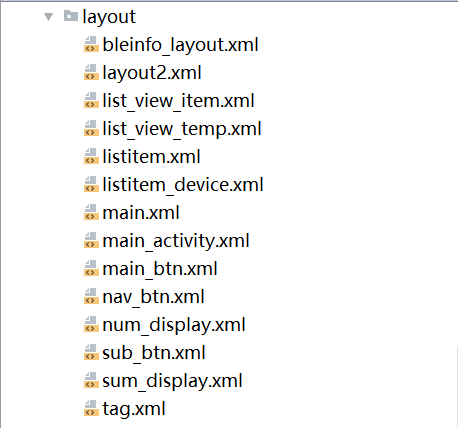
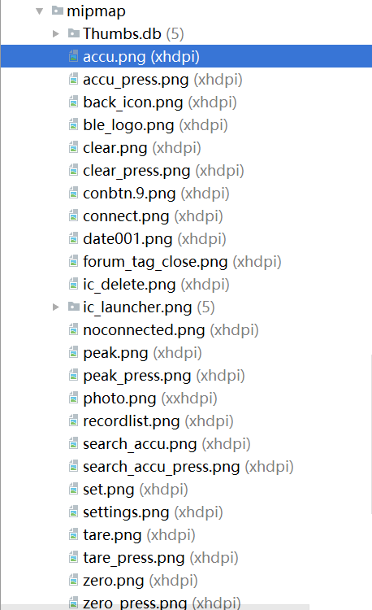

# Mytest
##1.About
>This is the android SDK for the EVERIGHT bluetooth electronic crane scale.

##2.Using
*1.Copy "everightlibrary-release.aar" to lib. 

*2.In the "androidmanife.xml", set the following figure, 1 is the bluetooth permission setting, and 2 declares the activity in the SDK. 

*3.In "build.gradle", the following figure is set, and 4 is the activity to be sent to the SDK to confirm the weighing result. 5 is about referencing the Settings for the SDK. 

*4. The following figure is the pass value specification and method name. 

*5. The file name in the Sdk package, please avoid the same file name in your package. 

*6. The Sdk has no restrictions and no serial number and other legal constraints. 
*7. Copyright belongs to hangzhou everight electronics co., LTD., and it will not allow any form of reverse cracking and violation of the law. 